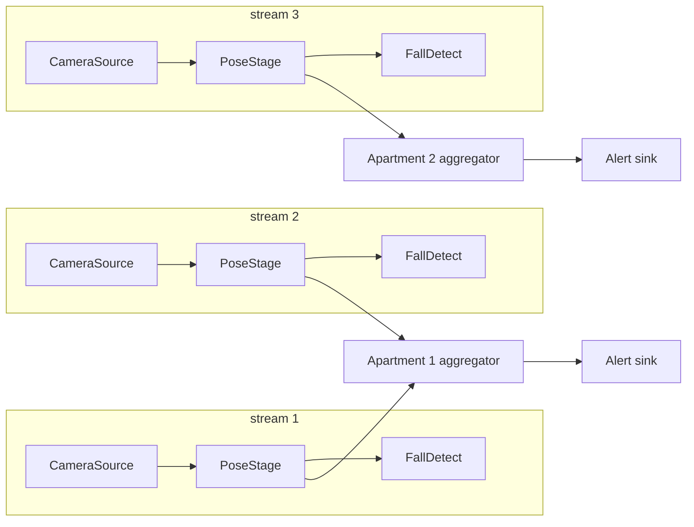

# Computer Vision Design Patterns

[](https://github.com/copier-org/copier)
[](https://github.com/astral-sh/uv)
[](https://github.com/astral-sh/ruff)

[]()
[](./reports/coverage/index.html)

Building blocks for real-time computer vision systems in Python. The core of
the library is **Pipeline v3**: a robust, supervised, multi-stream pipeline
framework designed for workloads like *N cameras → pose detection → fall
detection → per-apartment aggregation*, with hot add/remove of streams and
heavy stages running in child processes over shared memory.

The package also ships small utilities commonly needed around CV logic:
time-based [events](#events), threshold [counters](#counters), and a
[fuzzy boolean](#fuzzy) helper.

## Table of contents

- [Installation](#installation)
- [Pipeline v3](#pipeline-v3)
  - [Why v3](#why-v3)
  - [Architecture](#architecture)
  - [Core concepts](#core-concepts)
  - [Quick start](#quick-start)
  - [Runnable examples](#runnable-examples)
  - [Writing stages](#writing-stages)
  - [Wiring a graph](#wiring-a-graph)
  - [Dynamic streams (hot add/remove)](#dynamic-streams-hot-addremove)
  - [Process stages and shared-memory frames](#process-stages-and-shared-memory-frames)
  - [Overflow policies](#overflow-policies)
  - [Supervision: health, restarts, events](#supervision-health-restarts-events)
  - [Metrics](#metrics)
  - [Design rules of thumb](#design-rules-of-thumb)
- [Utilities](#utilities)
  - [Events](#events)
  - [Counters](#counters)
  - [Fuzzy](#fuzzy)
- [Legacy pipeline](#legacy-pipeline)
- [Development](#development)
- [Project structure](#project-structure)
- [License](#license)

## Installation

**Note**: You need [uv](https://docs.astral.sh/uv/) installed on your machine.

```bash
uv sync
```

Runtime dependencies are minimal: `numpy`, `loguru`, `transitions`. OpenCV is
a dev dependency, needed only by the camera/display reference stages and demos.

## Pipeline v3

`computer_vision_design_patterns.pipeline_v3` — a framework for building
real-time CV pipelines that are **bounded in memory, cleanly stoppable,
self-healing, and reconfigurable at runtime**.

### Why v3

Queue-based pipelines tend to accumulate the same failure modes: unbounded
queues that eat memory under backpressure, stages that own their own threads
and never shut down cleanly, string-keyed routing that breaks silently, and
`multiprocessing` code that only works by accident. v3 was designed against
those directly:

| Guarantee | How |
|---|---|
| Bounded memory | Every channel is bounded; video edges conflate to the newest frame by default |
| Clean shutdown | Sentinel drain protocol + timed joins + process terminate/kill fallback |
| Testable stages | Stages are pure `setup/process/teardown` logic — no threads, no queues |
| Validated wiring | Typed ports checked at connect time and before start (types, one edge per input, no dangling inputs, no cycles) |
| Real multiprocessing | Spawn-safe workers (Windows-compatible), metrics over a control bus, frames over shared memory |
| Self-healing | Per-stage restart policy with exponential backoff, bounded per time window |
| Runtime reconfiguration | Streams (camera branches) can be added and removed while running |

### Architecture

A supervisor owns the graph and one runner per stage. Runners execute stages
in threads or child processes and report back over a metrics bus. Data flows
through bounded channels created from the declared edges.



### Core concepts

| Concept | Module | Role |
|---|---|---|
| `Packet` | `packet.py` | Immutable data unit (`FramePacket`, `PosePacket`, `EventPacket`) carrying its own `stream_id`, `seq`, `ts_capture` |
| `Port` | `port.py` | Named, typed connection point on a stage; fan-in/fan-out is a property of the wiring, not the stage |
| `Channel` | `channel.py` | Bounded queue between two stages with an overflow policy and a sentinel drain protocol |
| `Stage` | `stage.py` | Pure logic: `setup()` / `process(inputs)` / `teardown()`; specializations `SourceStage`, `SinkStage`, `AggregatorStage` |
| `StageRunner` | `runner.py` | Owns the worker loop (thread or spawned process): input sweep, error backoff, source pacing, metrics heartbeats |
| `PipelineGraph` | `graph.py` | Declarative wiring with validation and stream tagging |
| `Supervisor` | `supervisor.py` | Lifecycle (start/stop), health loop, restart policy, dynamic streams, `on_event` notifications |
| `FrameWriter` / `FrameReader` | `framestore.py` | Shared-memory frame transport used automatically by cross-process channels |

### Quick start

```python
from computer_vision_design_patterns.pipeline_v3 import Supervisor
from computer_vision_design_patterns.pipeline_v3.stages import CameraSource, PoseStage, VideoSink

sup = Supervisor()
cam = CameraSource("cam1", source=0, target_fps=30.0)
pose = PoseStage("pose")
sink = VideoSink()

for stage in (cam, pose, sink):
    sup.add_stage(stage)
sup.chain(cam, pose, sink)  # single output → single input, LATEST_ONLY channels

with sup:  # start() on enter, clean stop() on exit
    input("running — press enter to stop\n")
```

### Runnable examples

Progressive, heavily commented demo scripts live in
[`dev/pipeline_v3/`](dev/pipeline_v3/README.md). Run them in order:

```bash
uv run python dev/pipeline_v3/dev_01_minimal.py         # source → sink basics, stats()
uv run python dev/pipeline_v3/dev_02_apartments.py      # 4 streams, 2 aggregators, hot add/remove
uv run python dev/pipeline_v3/dev_03_process_stages.py  # PROCESS stage + shared-memory frames
uv run python dev/pipeline_v3/dev_04_webcam.py          # real camera with reconnect (needs webcam)
```

### Writing stages

Stages contain **only domain logic**. Declare typed ports in `__init__`,
implement `process`, and never sleep, spawn threads, or touch queues — the
runner handles pacing, backoff, and shutdown.

**Transform** (1-in / 1-out or any combination):

```python
from computer_vision_design_patterns.pipeline_v3 import FramePacket, Packet, Stage

class GrayscaleStage(Stage):
    def __init__(self, name: str = "gray"):
        super().__init__(name=name)
        self.frames_in = self.add_input("frames", FramePacket)
        self.frames_out = self.add_output("frames", FramePacket)

    def process(self, inputs: dict[str, Packet]):
        # inputs contains only the ports that received data this tick
        packet = inputs.get("frames")
        if packet is None or packet.frame is None:
            return None  # emit nothing this tick
        import cv2
        gray = cv2.cvtColor(packet.frame, cv2.COLOR_BGR2GRAY)
        return {"frames": FramePacket(
            stream_id=packet.stream_id, seq=packet.seq,
            ts_capture=packet.ts_capture, frame=gray,
        )}
```

**Source** — implement `read()`; return `None` on failure/EOF and the runner
applies stop-aware exponential backoff (a dead camera neither busy-spins nor
blocks shutdown). `target_fps` caps the emit rate:

```python
from computer_vision_design_patterns.pipeline_v3 import FramePacket, SourceStage

class MySource(SourceStage):
    def __init__(self, stream_id: str):
        super().__init__(name=f"src-{stream_id}", target_fps=30.0)
        self.stream_id = stream_id
        self.out = self.add_output("frames", FramePacket)

    def read(self):
        frame = grab_frame_somehow()          # your capture code
        if frame is None:
            return None                       # runner backs off, then retries
        return FramePacket(stream_id=self.stream_id, seq=self.next_seq(), frame=frame)
```

**Sink** — implement `consume()`; raise `StopStage` for a graceful,
non-restartable stop (this is how `VideoSink` handles its quit key):

```python
from computer_vision_design_patterns.pipeline_v3 import Packet, SinkStage, StopStage

class AlertSink(SinkStage):
    def __init__(self):
        super().__init__(name="alerts")
        self.events_in = self.add_input("events", Packet)

    def consume(self, port_name: str, packet: Packet):
        send_alert(packet)
```

**Aggregator** — multi-stream fan-in with time-window alignment. Ports are
created per stream with `port_for(stream_id)`; frames are stripped on ingest
(buffers stay lightweight) and identical aligned sets are never emitted twice:

```python
from computer_vision_design_patterns.pipeline_v3 import AggregatorStage, EventPacket

class ApartmentAggregator(AggregatorStage):
    def __init__(self, name: str):
        super().__init__(name=name, window_s=0.5)
        self.summary_out = self.add_output("summary", EventPacket)

    def aggregate(self, aligned):  # {port_name: newest packet within window}
        streams = sorted(p.stream_id for p in aligned.values())
        return {"summary": EventPacket(stream_id=self.name, event_type="snapshot",
                                       metadata={"streams": streams})}
```

Lifecycle hooks available on every stage: `setup()` (open models/devices in
the worker), `teardown()` (release them), `on_port_closed(port_name)` (an
input edge went away — fan-in stages free per-port state here; the
`AggregatorStage` base already does).

### Wiring a graph

```python
sup = Supervisor()
sup.add_stage(stage)                    # register a stage
sup.connect(a, b)                       # single output → single input
sup.connect(a.out, b.frames_in)         # or explicit ports
sup.chain(cam, pose, sink)              # linear sugar for consecutive connects
```

Connections are validated immediately (port direction, packet-type
compatibility, one edge per input port) and the whole graph is validated at
`start()` (no dangling inputs, no cycles). Unconnected *outputs* are allowed —
their packets are simply dropped, so terminal stages like a fall detector
don't need a consumer.

Packet types follow substitution: a port emitting `PosePacket` may feed a port
accepting `Packet`, but not the other way around.

### Dynamic streams (hot add/remove)

`add_stream` describes a full camera branch in one call — and the **same call
works before start and while the pipeline is running**:

```python
apartment = sup.add_stage(ApartmentAggregator("apartment-1"))

sup.add_stream(
    "cam2",
    chain=[camera2, pose2],                        # new stages, wired linearly
    fanout={pose2.poses_out: [fall2]},             # one output → many new stages
    attach=[(pose2.poses_out, apartment.port_for("cam2"))],  # → existing stages
)

sup.remove_stream("cam2")
```

`remove_stream` stops the branch's runners, closes its channels, and the
surviving aggregator sees the close on that port and frees its buffers and
port automatically (`on_port_closed`). No manual cleanup.

### Process stages and shared-memory frames

Set `executor=ExecutorType.PROCESS` on CPU-heavy stages (pose models,
detectors) to escape the GIL:

```python
pose = PoseStage("pose", executor=ExecutorType.PROCESS)
```

What happens under the hood:

- The stage is pickled into a **spawned** child process (Windows-compatible).
  Construct PROCESS stages with picklable state only; open models in `setup()`.
- Edges touching a PROCESS stage become `ProcessChannel`s, which move frames
  through **shared memory** instead of pickling pixels: the producer swaps
  `packet.frame` for a `FrameRef`, the consumer copies it back out. Each slot
  carries a generation stamp before *and* after the pixels, so stale or torn
  reads are detected and counted as drops — never delivered.
- Metrics and heartbeats flow back to the supervisor over a shared control-bus
  queue (`sup.stats()` shows the child's `pid`).

One constraint, enforced with a clear error: you cannot **hot-attach** a new
stream to a stage already running in a child process (its channels are fixed
at spawn). Stages that accept streams at runtime — aggregators — should stay
`THREAD`.

### Overflow policies

Every channel is bounded; the policy decides what happens when it's full:

| Policy | Behavior | Use for |
|---|---|---|
| `LATEST_ONLY` (default) | Depth-1 conflating buffer — newest item wins | Live video: a late frame is a useless frame |
| `DROP_OLDEST` | Ring-buffer semantics over `maxsize` items | Streams where recent history matters |
| `BLOCK` | Producer waits (with timeout) for space | Events/alerts that must not be dropped |

```python
sup.connect(fall.events_out, alert_sink.events_in,
            policy=OverflowPolicy.BLOCK, maxsize=64)
```

Drops are counted per channel and surface in `stats()`.

### Supervision: health, restarts, events

- Every worker pushes metrics/heartbeat snapshots (~4/s). The health loop
  flags stages whose heartbeat goes stale.
- A worker that dies unexpectedly (e.g. exceeded `max_consecutive_failures`)
  is **restarted** according to its `ErrorPolicy` — up to `max_restarts`
  within `restart_window_s` — then marked failed. No infinite crash loops.
- A stage that raises `StopStage` stops gracefully and is *not* restarted.
- Pass `on_event=` to observe everything:

```python
from computer_vision_design_patterns.pipeline_v3 import ErrorPolicy, Supervisor

sup = Supervisor(on_event=lambda e: print(e.kind, e.stage_name, e.stream_id))
# kinds: pipeline_started, pipeline_stopped, stream_added, stream_removed,
#        stage_restarted, stage_failed, stage_stale

flaky = MySource("cam1")
flaky.error_policy = ErrorPolicy(max_consecutive_failures=3, max_restarts=5,
                                 restart_window_s=120.0)
```

### Metrics

```python
for name, m in sup.stats().items():
    print(f"{name}: pid={m.pid} processed={m.processed} fps={m.fps:.1f} "
          f"drops={m.drops} latency={m.last_latency_ms:.2f}ms healthy={m.healthy}")
```

Snapshots are copies — safe to keep or ship to your monitoring system.

### Design rules of thumb

1. Stages never sleep — the runner paces sources (`target_fps`) and idles consumers.
2. Heavy models → `ExecutorType.PROCESS`; sources, sinks, aggregators → `THREAD`.
3. Video edges keep the `LATEST_ONLY` default; must-not-drop event edges use `BLOCK` with a real `maxsize`.
4. One input port per producer — fan-in means multiple ports (see `port_for`), never multiple writers on one port.
5. PROCESS stages hold picklable construction state only; open resources in `setup()`.

## Utilities

Small, dependency-light helpers for CV application logic. Runnable examples
live in `dev/`.

### Events

`TimeEvent` activates immediately on `trigger()` and auto-deactivates after a
duration (thread-safe). Retriggering resets the timer — useful for "person
seen in the last N seconds" style logic:

```python
from computer_vision_design_patterns.event import TimeEvent

presence = TimeEvent(2.0)
presence.trigger()
presence.is_active()  # True for the next 2 seconds
```

`CountdownEvent` is the inverse: it starts inactive, arms on `trigger()`, and
activates once the countdown elapses — useful for "alarm only if the condition
persists for N seconds". It stays active until `reset()`:

```python
from computer_vision_design_patterns.event import CountdownEvent

alarm = CountdownEvent(3.0)
alarm.trigger()
alarm.is_active()  # False now, True after 3 seconds, until reset()
```

### Counters

`ManualCounter` activates when it reaches a threshold — e.g. "N consecutive
detections before firing":

```python
from computer_vision_design_patterns.counter import ManualCounter

confirmations = ManualCounter(3)
confirmations.update()          # 1
confirmations.update()          # 2
confirmations.update()          # 3 → active
confirmations.is_active()       # True
confirmations.reset()
```

### Fuzzy

`ConditionalBoolean` wraps a predicate so thresholded conditions can be passed
around and evaluated lazily:

```python
from computer_vision_design_patterns.fuzzy import ConditionalBoolean

is_confident = ConditionalBoolean(lambda score: score > 0.7)
is_confident.eval(0.85)  # True
```

## Legacy pipeline

`computer_vision_design_patterns.pipeline` is the original queue-based
pipeline (v2). It is kept for reference and existing users but is **legacy**:
prefer `pipeline_v3` for all new work.

## Development

```bash
uv sync                                   # install everything (incl. dev deps)
uv run pytest tests/pipeline_v3 -q        # pipeline v3 test suite
uv run pytest -q                          # full test suite
uv run ruff check src tests dev           # lint
uv run pre-commit run --all-files         # all pre-commit checks
```

The v3 test suite covers channels (policies, drop accounting, sentinel
pickling), the shared-memory frame transport (including torn/stale-read
detection), graph validation, runner behavior (graceful stop vs. crash,
pacing, port closure), supervision (restart policy, events, hot add/remove),
a real spawned-process end-to-end test, and an integration test of the full
multi-stream / multi-aggregator topology.

## Project structure

```
src/computer_vision_design_patterns/
├── pipeline_v3/          # the v3 framework
│   ├── packet.py         #   Packet types + SENTINEL
│   ├── port.py           #   typed ports
│   ├── channel.py        #   bounded channels (thread + process)
│   ├── framestore.py     #   shared-memory frame transport
│   ├── stage.py          #   Stage / Source / Sink / Aggregator
│   ├── runner.py         #   StageRunner + worker loop
│   ├── graph.py          #   PipelineGraph + validation
│   ├── supervisor.py     #   Supervisor + events
│   └── stages/           #   reference stages (camera, synthetic, pose, fall, apartment, video sink)
├── pipeline/             # legacy v2 pipeline
├── event.py              # TimeEvent, CountdownEvent
├── counter.py            # ManualCounter
└── fuzzy.py              # ConditionalBoolean

dev/pipeline_v3/          # progressive runnable demos (see its README)
tests/pipeline_v3/        # v3 test suite
```

## Technology stack

- [uv](https://docs.astral.sh/uv/) for Python and project management
- [pre-commit](https://pre-commit.com/) with [ruff](https://docs.astral.sh/ruff/) for code consistency
- [GitHub Actions](https://github.com/features/actions) for releases and package publishing

## Contributing

Contributions are welcome! Please feel free to submit a Pull Request.

## License

This project is licensed under the MIT License - see the LICENSE file for details.
